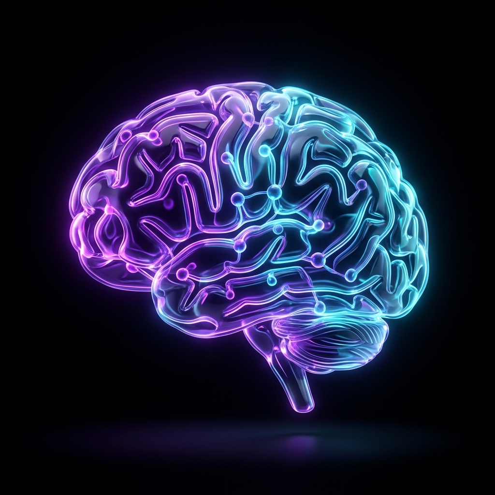
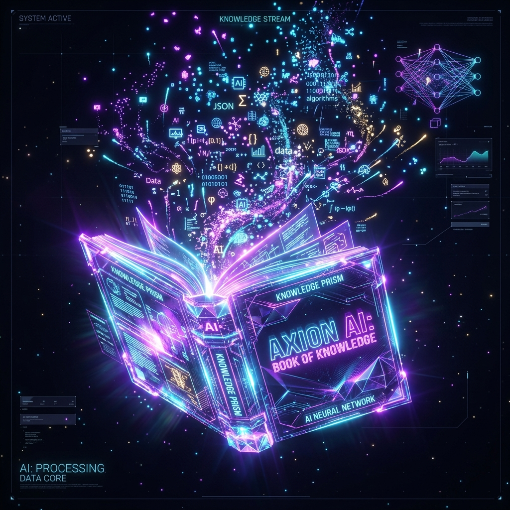
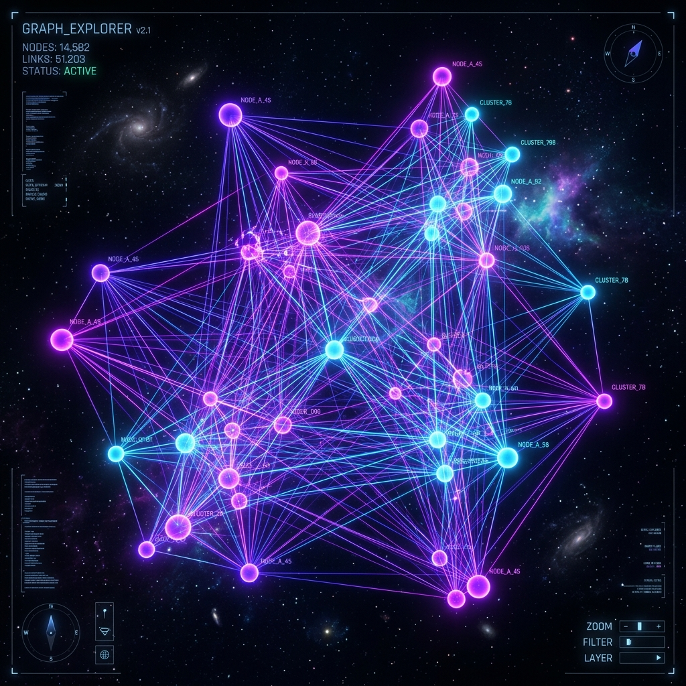
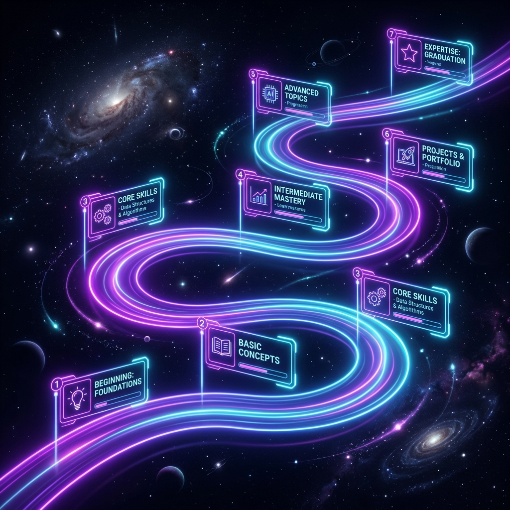

# 🧠 NeuroLearn AI — Adaptive Learning Studio

> **Learn Anything. Retain Everything.**
> An AI-powered, multi-modal adaptive learning studio that transforms any topic into interactive explanations, visual knowledge maps, Feynman technique coaching, adaptive quizzes, and structured study roadmaps.



---

## ✨ Features

NeuroLearn AI gives learners access to **5 specialized AI-powered learning tools** — all in one unified studio:

### 💡 1. Concept Explainer
Explains any topic across **5 distinct learning styles** powered by live AI:
- **ELI5** — Simple words and relatable analogies for absolute beginners.
- **Scholar** — Academic structure with conceptual depth and formal vocabulary.
- **Technical** — Precise definitions, implementation mechanics, and edge cases.
- **Storytelling** — Engaging narratives that embed concepts in relatable scenarios.
- **Analogy-Based** — Bridges abstract ideas to familiar everyday objects and experiences.

### 🕸️ 2. Interactive Knowledge Graph
- Generates live, **force-directed concept maps** powered by **D3.js v7**.
- Visualizes core concepts, prerequisites, and related topics as interactive nodes.
- Supports **drag-and-drop** node exploration, **zoom**, and connection inspection on click.
- Color-coded node types (core, prerequisite, related, application) with animated glow edges.

### 🧑‍🏫 3. Feynman Coach
- Evaluates your written explanation against a **strict 0–100% scoring rubric**.
- Identifies knowledge gaps and provides personalized AI feedback and study recommendations.
- Features an **animated SVG score gauge** with a visual progress bar and mastery label.
- Graceful word-count heuristic fallback when AI score parsing fails.

### 🎯 4. Adaptive Quiz Studio
- Generates **5 multiple-choice questions** tailored to topic and difficulty level (Easy / Medium / Hard).
- Robust answer normalization engine supporting numeric, letter, and text-based AI responses.
- Tracks **streak**, **accuracy**, and outputs a final **Mastery Performance Card** (Novice → Expert).
- Per-question explanation reveals on answer selection with AI-generated context.

### 🗺️ 5. Adaptive Study Roadmap
- Designs structured, week-by-week curriculums tailored to any **learning goal and timeframe**.
- Generates milestones, estimated commitment hours, and recommended free resources.
- **One-click download** of the full roadmap as a `.txt` file for offline tracking.
- **Copy-to-clipboard** button included in the output panel.

---

## 🖼️ Screenshots

| Concept Explainer | Knowledge Graph |
|:-:|:-:|
|  |  |

| Feynman Coach | Adaptive Quiz |
|:-:|:-:|
|  |  |

| Study Roadmap | |
|:-:|:-:|
|  | |

---

## 🛠️ Technology Stack

| Layer | Technology |
|---|---|
| **Markup** | HTML5 (Semantic) |
| **Styling** | Vanilla CSS3 — Glassmorphism & dark cyber aesthetics |
| **Landing / Auth Pages** | Tailwind CSS v3 (CDN) + Flowbite v2 components |
| **Typography** | Plus Jakarta Sans (landing/auth) · Inter & JetBrains Mono (studio) |
| **Logic** | Vanilla JavaScript ES6+ (Strict Mode) |
| **Visualization** | D3.js v7 — Force Simulation, Zoom Behavior, SVG rendering |
| **Markdown Rendering** | Marked.js |
| **AI Backend** | OpenRouter API (`openrouter/auto` — live model routing) |
| **Auth** | Supabase Auth (session management, sign-in/sign-up, sign-out) |

---

## 📁 Project Structure

```
neurolearn-ai/
├── index.html              # Marketing landing page
├── app.html                # Main AI learning studio (5 tools)
├── pitch.html              # Investor / demo pitch deck
├── assets/
│   ├── auth.js             # Shared Supabase auth manager
│   ├── logo.png
│   ├── explainer.png
│   ├── feynman.png
│   ├── graph.png
│   ├── quiz.png
│   └── roadmap.png
└── src/
    └── pages/
        ├── about.html      # About / mission page
        ├── contact.html    # Contact page
        ├── signin.html     # Sign-in page
        └── signup.html     # Sign-up page
```

---

## 🚀 Quick Start

### 1. Clone the repository

```bash
git clone https://github.com/YOUR_USERNAME/neurolearn-ai.git
cd neurolearn-ai
```

### 2. Run locally

Open `index.html` directly in any modern browser — **no build step, no `npm install`** required.

```
Chrome / Edge / Firefox / Safari → File > Open > index.html
```

For the full studio experience, open `app.html` directly.

### 3. Configure your OpenRouter API Key

The AI features require an [OpenRouter API Key](https://openrouter.ai/keys):

1. Open `app.html` in your browser.
2. Click the **"OpenRouter Connected"** pill in the top-right corner.
3. Paste your API key. It is stored only in `localStorage` — never sent anywhere except OpenRouter.

### 4. (Optional) Configure Supabase Auth

To enable user accounts (sign-in / sign-up):

1. Create a project on [Supabase](https://supabase.com).
2. Replace the `SUPABASE_URL` and `SUPABASE_ANON_KEY` values in `index.html` and the auth pages with your project credentials.

---

## ⌨️ Keyboard Shortcuts (Studio)

| Shortcut | Action |
|---|---|
| `?` | Open keyboard shortcuts overlay |
| `Esc` | Close overlays / panels |

---

## 🌐 Pages Overview

| Page | Path | Description |
|---|---|---|
| Landing | `index.html` | Marketing homepage with hero, features, and CTA |
| Studio | `app.html` | Full AI learning studio with all 5 tools |
| Pitch Deck | `pitch.html` | Investor / demo presentation slide deck |
| About | `src/pages/about.html` | Mission, methodology, and team |
| Contact | `src/pages/contact.html` | Contact form and info |
| Sign In | `src/pages/signin.html` | User authentication — sign in |
| Sign Up | `src/pages/signup.html` | User authentication — sign up |

---

## 📜 License

Distributed under the **MIT License**. See `LICENSE` for details.

---

<div align="center">
  <sub>Built with ❤️ using HTML, CSS, JavaScript, D3.js, Marked.js, OpenRouter & Supabase</sub>
</div>
